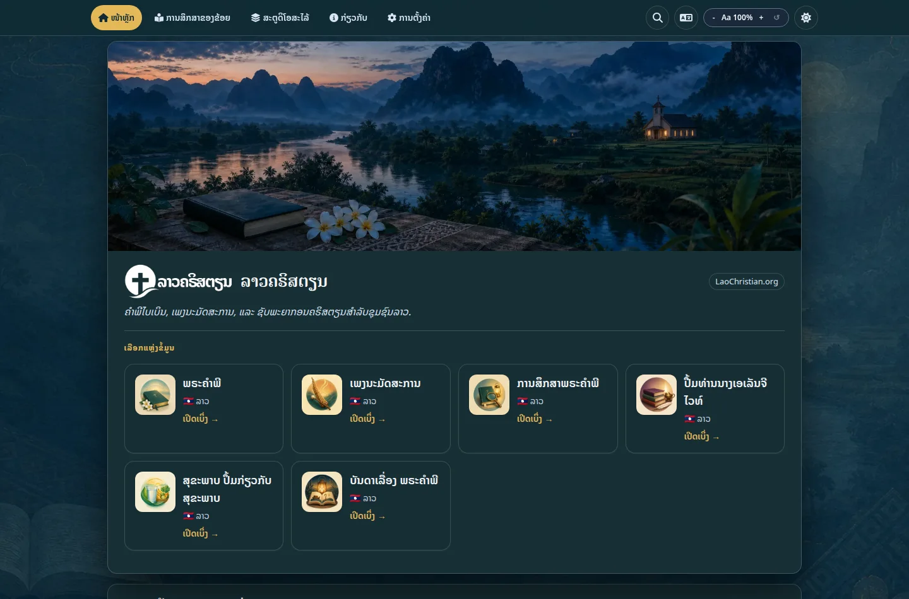

# ແອັບ

ແພລດຟອມແອັບ LaoChristian.org ນຳເອົາຊັບພະຍາກອນການອ່ານ, ການນະມັດສະການ, ການສຶກສາ ແລະ ການນຳສະເໜີຂອງຄຣິສຕຽນລາວມາລວມກັນໃນແອັບເວັບສອງພາສາທີ່ສາມາດຕິດຕັ້ງໄດ້. ມັນຖືກອອກແບບມາເພື່ອການອ່ານພາສາລາວທີ່ສະດວກສະບາຍ ແລະ ການນຳໃຊ້ທີ່ໜ້າເຊື່ອຖືໃນການເຊື່ອມຕໍ່ທີ່ຊ້າກວ່າ ຫຼື ບໍ່ຕໍ່ເນື່ອງ.

**[ເປີດແພລດຟອມແອັບ →](https://apps.laochristian.org/)**

[{ .lc-app-screenshot }](https://apps.laochristian.org/)

## ສິ່ງທີ່ທ່ານສາມາດໃຊ້

- **ຄຳພີໄບເບິນພາສາລາວ** ສຳລັບການອ່ານ ແລະ ການສຶກສາ
- **ເພງນະມັດສະການສຽງແຄນລາວ**
- **ການສຶກສາຄຳພີໄບເບິນ, ເລື່ອງລາວໃນຄຳພີໄບເບິນ, ຊັບພະຍາກອນສຸຂະພາບ, ແລະ ປຶ້ມຄຣິສຕຽນ**
- **ຄົ້ນຫາ, ຂະໜາດຂໍ້ຄວາມທີ່ສາມາດປັບໄດ້, ຫົວຂໍ້, ແລະ ຕົວອັກສອນອ່ານພາສາລາວທີ່ເລືອກໄດ້**
- **ເຄື່ອງມືນຳສະເໜີ ແລະ ສົ່ງອອກ** ສຳລັບການແບ່ງປັນເອກະສານກັບກຸ່ມ

ແພລດຟອມດັ່ງກ່າວແມ່ນ Progressive Web App (PWA). ທ່ານສາມາດເພີ່ມມັນໃສ່ໜ້າຈໍຫຼັກຂອງທ່ານ, ແລະມັນຈະເກັບເນື້ອຫາທີ່ດາວໂຫຼດມາໄວ້ໃນເຄື່ອງເພື່ອການອ່ານແບບອອບໄລນ໌.
ມັນຍັງກວດສອບເປັນໄລຍະເພື່ອຊອກຫາເນື້ອຫາທີ່ອັບເດດແລ້ວ ໃນຂະນະທີ່ຮັກສາເນື້ອຫາທີ່ເກັບໄວ້ໄວ້
ເມື່ອການເຊື່ອມຕໍ່ບໍ່ສາມາດໃຊ້ໄດ້.
