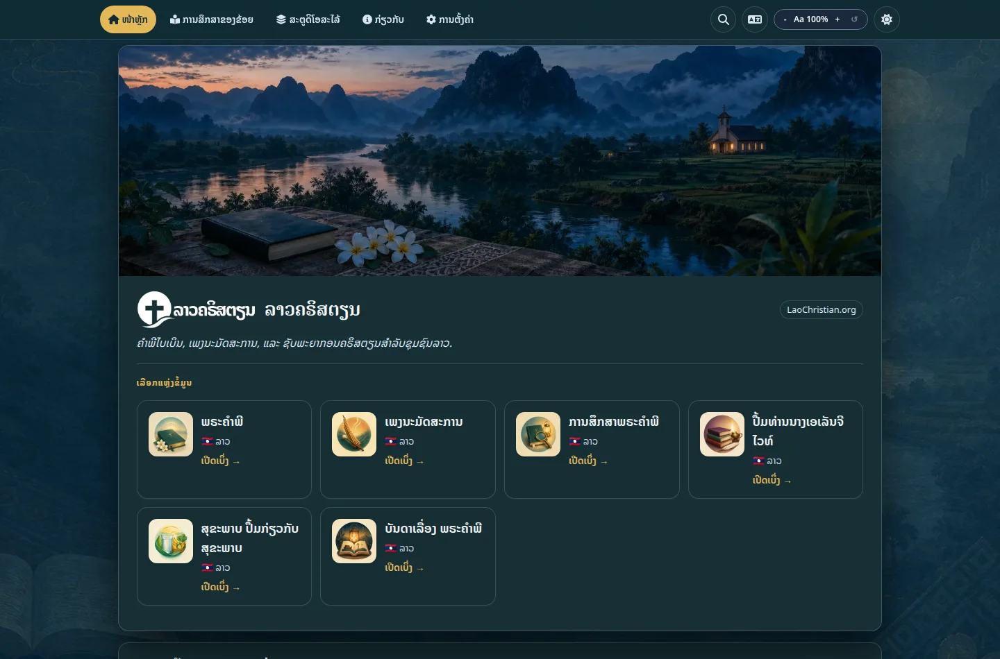

# ແອັບ

ແພລດຟອມແອັບ LaoChristian.org ນຳເອົາຊັບພະຍາກອນການອ່ານ, ການນະມັດສະການ, ການສຶກສາ ແລະ ການນຳສະເໜີຂອງຄຣິສຕຽນລາວມາລວມກັນໃນແອັບເວັບສອງພາສາທີ່ສາມາດຕິດຕັ້ງໄດ້. ມັນຖືກອອກແບບມາເພື່ອການອ່ານພາສາລາວທີ່ສະດວກສະບາຍ ແລະ ການນຳໃຊ້ທີ່ໜ້າເຊື່ອຖືໃນການເຊື່ອມຕໍ່ທີ່ຊ້າກວ່າ ຫຼື ບໍ່ຕໍ່ເນື່ອງ.

**[ເປີດແພລດຟອມແອັບ →](https://apps.laochristian.org/)**

[{ .lc-app-screenshot }](https://apps.laochristian.org/)

## ສິ່ງທີ່ທ່ານສາມາດໃຊ້

- **ຄຳພີໄບເບິນພາສາລາວ** ສຳລັບການອ່ານ ແລະ ການສຶກສາ
- **ເພງນະມັດສະການສຽງແຄນລາວ**
- **ການສຶກສາຄຳພີໄບເບິນ, ເລື່ອງລາວໃນຄຳພີໄບເບິນ, ຊັບພະຍາກອນສຸຂະພາບ, ແລະ ປຶ້ມຄຣິສຕຽນ**
- **ຄົ້ນຫາ, ຂະໜາດຂໍ້ຄວາມທີ່ສາມາດປັບໄດ້, ຫົວຂໍ້, ແລະ ຕົວອັກສອນອ່ານພາສາລາວທີ່ເລືອກໄດ້**
- **ເຄື່ອງມືນຳສະເໜີ ແລະ ສົ່ງອອກ** ສຳລັບການແບ່ງປັນເອກະສານກັບກຸ່ມ

ແພລດຟອມດັ່ງກ່າວແມ່ນ Progressive Web App (PWA). ທ່ານສາມາດເພີ່ມມັນໃສ່ໜ້າຈໍຫຼັກຂອງທ່ານ, ແລະມັນຈະເກັບເນື້ອຫາທີ່ດາວໂຫຼດມາໄວ້ໃນເຄື່ອງເພື່ອການອ່ານແບບອອບໄລນ໌.
ມັນຍັງກວດສອບເປັນໄລຍະເພື່ອຊອກຫາເນື້ອຫາທີ່ອັບເດດແລ້ວ ໃນຂະນະທີ່ຮັກສາເນື້ອຫາທີ່ເກັບໄວ້ໄວ້
ເມື່ອການເຊື່ອມຕໍ່ບໍ່ສາມາດໃຊ້ໄດ້.

  
  

    <h2>ບົດຮຽນວັນຊະບາໂຕ (Sabbath School) ເປັນພາສາລາວ (ທາງການ)</h2>
    
ສຶກສາບົດຮຽນວັນຊະບາໂຕປະຈຳອາທິດເປັນພາສາລາວ ດ້ວຍແອັບທາງການຂອງສູນລວມໃຫຍ່ຄຣິສຕະຈັກແອດເວນຕິສ.

    

      
      
      
    

    
ບົດຮຽນວັນຊະບາໂຕ ສ້າງ ແລະ ດູແລໂດຍ <a href="https://adventech.io/sabbath-school/" rel="noopener" target="_blank">Adventech</a> ໂດຍຮ່ວມມືກັບກົມບົດຮຽນວັນຊະບາໂຕ ແລະ ການປະກາດສ່ວນຕົວຂອງສູນລວມໃຫຍ່ຄຣິສຕະຈັກແອດເວນຕິສ. ເປັນເວັບໄຊພາຍນອກ; LaoChristian.org ບໍ່ໄດ້ເປັນເຈົ້າຂອງ ຫຼື ດຳເນີນງານ. App Store ເປັນເຄື່ອງໝາຍບໍລິການຂອງ Apple Inc.; Google Play ເປັນເຄື່ອງໝາຍການຄ້າຂອງ Google LLC.

  

